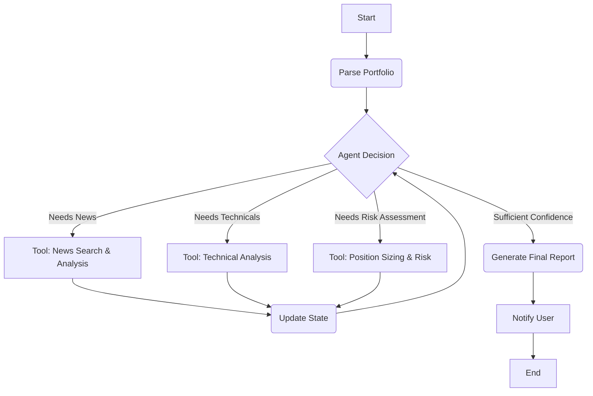
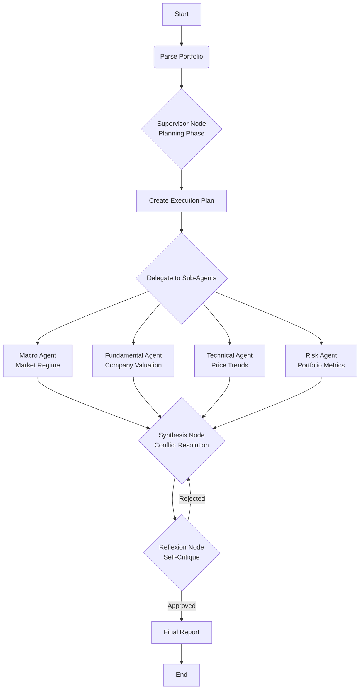

# Stock Researcher Architecture

This document describes the two primary architectures in this project: the new **Autonomous Portfolio Manager** and the original **Legacy Sequential Pipeline**.

## 1. Autonomous Portfolio Manager Architecture (LangGraph-Based)

The new autonomous agent is built using `LangGraph` to create a stateful, cyclical, and intelligent workflow. Unlike the rigid sequential pipeline, this architecture allows an AI agent to decide which tools to use and when, based on the evolving state of the analysis.

### High-Level Flow

The system is a graph where the Portfolio Manager agent repeatedly decides on the next best action, calls a tool, updates its state, and loops until it is confident enough to generate a final report.



### Key Components

-   **State (`AgentState`)**: A central dictionary that holds all information about the current analysis, including portfolio data, tool results, and reasoning history. It is passed between every step.
-   **Nodes**: Functions that represent a specific action, such as the agent's decision-making "brain" (`agent_decision_node`) or a tool executor (`tool_execution_node`).
-   **Edges**: Conditional logic that routes the flow of the graph based on the agent's decisions (e.g., call a tool or generate the final report).

This event-driven architecture makes the system more efficient, adaptable, and intelligent, as it only performs the analysis that is necessary for the given portfolio.

### V3 Multi-Agent Supervisor Architecture (Phase 3 - In Progress)

**Status:** Phase 3 Week 1 - Supervisor Node Complete ✅

The V3 architecture introduces a **Supervisor-based Multi-Agent System** where specialized sub-agents handle different analysis domains, coordinated by a central Supervisor Node.



**Sub-Agent Nodes (Phase 2 - Complete):**
- **Macro Agent** (`macro_agent.py`): Analyzes macroeconomic conditions using FRED API (GDP, CPI, yield curve, VIX). Determines market regime (Goldilocks/Inflationary/Deflationary) and risk sentiment (Risk-On/Risk-Off).
- **Fundamental Agent** (`fundamental_agent.py`): Assesses company valuation using Polygon.io fundamentals. Analyzes market cap, sector positioning, and financial health per ticker.
- **Technical Agent** (`technical_agent.py`): Evaluates price trends and timing using technical indicators. Analyzes SMA, RSI, MACD, Bollinger Bands, and trend classification.
- **Risk Agent** (`risk_agent.py`): Calculates portfolio risk metrics including Sharpe Ratio, Beta, VaR (95%), Max Drawdown, and portfolio volatility.

**Orchestration Nodes (Phase 3):**
- **Supervisor Node** (`supervisor.py`) ✅ **Complete**: Orchestrates the multi-agent workflow by creating execution plans and delegating to specialized sub-agents. Implements graceful degradation when agents fail. Tracks completion status and aggregates results for synthesis.
- **Synthesis Node** (`synthesis.py`) ⏳ **Next**: Combines sub-agent outputs, detects conflicts (e.g., Fundamental says "Buy" but Technical says "Sell"), and resolves divergences using weighted decision logic.
- **Reflexion Node** (`reflexion.py`) ⏳ **Planned**: Applies self-critique with "Risk Officer" persona to review synthesis output for biases, errors, and inconsistencies before finalizing recommendations.

**Key Features:**
- **Graceful Degradation**: If one sub-agent fails, the supervisor continues with remaining agents
- **State Tracking**: Monitors completion status of each sub-agent (`sub_agent_status` field)
- **Execution Planning**: LLM-based planning determines optimal agent invocation order
- **Fallback Logic**: Default execution plan used if LLM planning fails
- **Comprehensive Testing**: 16 supervisor tests, 373 total tests passing

---

## 2. Legacy Sequential Pipeline Architecture

The workflow is heavily optimized for performance, with expensive I/O and API calls (data fetching, news summarization, technical analysis) running concurrently to minimize execution time.

The process begins in `main.py`, which first attempts a non-blocking price update before handing off to the main orchestrator. The orchestrator then coordinates the agents in a multi-stage, parallelized pipeline.

```mermaid
graph TD
    subgraph "main.py Entry Point"
        A[Start] --> B{Attempt Price Update};
        B -- Success --> C[Run Orchestrator];
        B -- Failure --> D[Log Warning & Send WhatsApp Alert];
        D --> C;
    end

    subgraph "Orchestrator Pipeline"
        C --> E[Agent 1: Parse Portfolio];
        E --> F((Data Fetching));
        F --> G[Agent 2: News Searcher];
        F --> H[Data Fetcher: OHLCV];
        
        subgraph "Parallel AI Analysis"
            G --> I[Agent 3: Summarize News<br>(gemini-2.5-flash)];
            H --> J[Agent 4: Analyze Technicals<br>(gemini-2.5-flash)];
        end

        I --> K((Final Reasoning));
        J --> K;
        E --> K;
        
        K --> L[Agent 5: Portfolio Manager<br>(gemini-2.5-pro)];
    end
    
    subgraph "Output"
        L --> M[Display Full Report in Console];
        L --> N[Send Recommendations via WhatsApp];
    end

```

## Agent Responsibilities

### Agent 1: Portfolio Parser (`agents/portfolio_parser.py`)
- **Input**: Google Sheet credentials.
- **Process**: Connects to Google Sheets using `gspread` and parses the portfolio data into structured `Portfolio` and `PortfolioPosition` data classes.
- **Output**: A `Portfolio` object containing all positions.

### Agent 2: News Searcher (`agents/news_searcher.py`)
- **Input**: A list of stock tickers.
- **Process**: Uses the `SerpApi` to search for recent news articles for each stock ticker.
- **Output**: A dictionary mapping each ticker to a list of news articles.

### Agent 3: News Summarizer (`agents/llm_analyzer.py`)
- **Input**: The dictionary of news articles.
- **Process**: For each stock, sends the news articles to the `gemini-1.5-flash` model to generate a concise executive summary, a sentiment score, and an actionable takeaway. These calls are executed concurrently using a `ThreadPoolExecutor` for performance.
- **Output**: A dictionary mapping each ticker to its AI-generated summary.

### Agent 4: Technical Analyst (`agents/technical_analyzer.py`)
- **Input**: A list of stock tickers.
- **Process**: 
    1. Fetches 1 year of historical OHLCV data using the `yfinance` library.
    2. Calculates key technical indicators (SMA, RSI, MACD) using `pandas-ta`.
    3. Sends these indicators to the `gemini-1.5-flash` model for a concise summary of the stock's technical health. These calls are also executed concurrently.
- **Output**: A dictionary mapping each ticker to its AI-generated technical analysis.

### Agent 5: Portfolio Manager (`agents/portfolio_manager.py`)
- **Input**: The `Portfolio` object, news summaries, and technical analyses.
- **Process**: This is the final reasoning engine. It aggregates all the inputs into a single, comprehensive prompt for the more powerful `gemini-2.5-pro` model. It asks the model to provide a holistic portfolio assessment and generate specific, actionable recommendations (e.g., INCREASE/DECREASE position) based on all available data.
- **Output**: A structured dictionary containing the overall assessment and specific recommendations.

## Core Utilities

### `utils/llm_utils.py`
- Centralizes all interactions with the Google Gemini API.
- Handles client initialization and provides a robust `call_gemini_api` function that uses the `tenacity` library for automatic retries with exponential backoff. This makes all AI calls resilient to temporary API failures.

### `utils/technical_analysis_utils.py`
- Contains the `calculate_technical_indicators` function.
- Uses the `pandas-ta` library to calculate SMA, RSI, and MACD from the raw OHLCV data, providing a clean dictionary of indicators for the Technical Analyst Agent.

## Price Update Pre-processing

The price update logic in `pre_processor/update_prices.py` is called at the beginning of `main.py`. This step ensures the portfolio valuation is based on the latest available data.

- **Robustness**: The process is wrapped in a `try...except` block. If `yfinance` fails to fetch prices, the failure is logged, a WhatsApp alert is sent, and the main application proceeds with the last known prices from the sheet. This prevents data source flakiness from blocking the core analysis.
- **Manual Override**: For convenience, the `update_prices_main.py` script allows for running the price update process manually without triggering the full research workflow.

