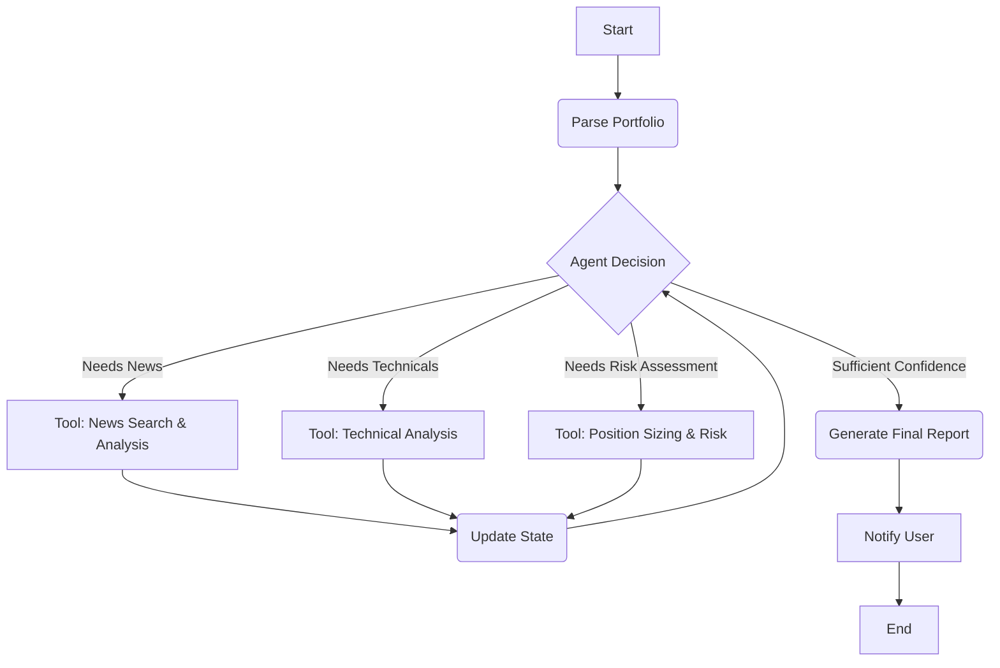

# Portfolio Manager Architecture

This document describes the architecture of the **Autonomous Portfolio Manager**, an intelligent, agent-based system built using `LangGraph` for stateful workflow orchestration.

## Overview

The new autonomous agent is built using `LangGraph` to create a stateful, cyclical, and intelligent workflow. Unlike the rigid sequential pipeline, this architecture allows an AI agent to decide which tools to use and when, based on the evolving state of the analysis.

### High-Level Flow

The system is a graph where the Portfolio Manager agent repeatedly decides on the next best action, calls a tool, updates its state, and loops until it is confident enough to generate a final report.



### Key Components

-   **State (`AgentState`)**: A central dictionary that holds all information about the current analysis, including portfolio data, tool results, and reasoning history. It is passed between every step.
-   **Nodes**: Functions that represent a specific action, such as the agent's decision-making "brain" (`agent_decision_node`) or a tool executor (`tool_execution_node`).
-   **Edges**: Conditional logic that routes the flow of the graph based on the agent's decisions (e.g., call a tool or generate the final report).

This event-driven architecture makes the system more efficient, adaptable, and intelligent, as it only performs the analysis that is necessary for the given portfolio.

---

## Module Architecture

The Portfolio Manager is organized into logical modules, each with clear responsibilities:

### Core Modules

#### `agent_state.py`
- **Purpose**: Defines the central state schema (`AgentState`) that flows through the entire graph
- **Key Classes**:
  - `AgentState`: TypedDict holding portfolio data, analysis results, confidence scores, and reasoning traces
  - `ToolResult`: Structured result format for all tool executions
- **State Management**: Immutable state updates ensure predictable behavior throughout the workflow

#### `tool_registry.py`
- **Purpose**: Decorator-based tool registration system
- **Features**:
  - `@tool` decorator for automatic tool registration
  - Metadata extraction (parameters, descriptions, examples)
  - Runtime validation of tool calls
  - Dynamic prompt generation for LLM context

#### `schemas.py`
- **Purpose**: Pydantic models for data validation
- **Key Models**:
  - `Portfolio`: Portfolio-level data with total value
  - `PortfolioPosition`: Individual stock position details
  - `GuardrailLimits`: Safety constraints and operational limits

### Graph Components (`graph/`)

#### `main.py`
- **Purpose**: Entry point for the autonomous agent workflow
- **Responsibilities**: Builds and executes the LangGraph workflow, manages error handling

#### `builder.py`
- **Purpose**: Constructs the state graph with nodes and edges
- **Features**: Configures recursion limits, adds guardrail checks, compiles the executable graph

#### `nodes/`
Individual graph nodes representing discrete actions:

- **`start.py`**: Initializes state and loads portfolio data
- **`agent_decision.py`**: LLM-powered decision node that selects next actions
- **`tool_execution.py`**: Executes tools requested by the agent
- **`guardrails.py`**: Safety checks (iteration limits, cost limits, error thresholds)
- **`final_report.py`**: Generates comprehensive portfolio analysis report

#### `edges.py`
- **Purpose**: Conditional routing logic
- **Function**: `should_continue()` decides whether to loop, generate report, or terminate

### Integration Modules (`integrations/`)

External service integrations with retry logic and error handling:

#### `google_sheets.py`
- **Functions**: `parse_portfolio()`, `update_gsheet_prices()`
- **Features**: OAuth2 authentication, structured data parsing, price updates

#### `polygon.py`
- **Functions**: `fetch_ohlcv_data()`
- **Features**: Historical market data retrieval, DataFrame construction, date range calculation

#### `serp_api.py`
- **Functions**: `get_stock_news()`
- **Features**: Google News search, structured article extraction, Pydantic models

#### `pushover.py`
- **Functions**: `send_pushover_message()`
- **Features**: Mobile push notifications, error alerts, completion notifications

### Analysis Modules (`analysis/`)

AI-powered analysis with concurrent execution:

#### `news_analyzer.py`
- **Functions**: `generate_executive_summaries()`, `_generate_summary_for_ticker()`
- **Features**: LLM-based news summarization, sentiment analysis, concurrent processing

#### `technical_analyzer.py`
- **Functions**: `analyze_stock_technicals()`, `calculate_technical_indicators()`
- **Features**: 
  - Vectorized technical indicator calculations (SMA, RSI, MACD)
  - LLM-based technical analysis interpretation
  - Concurrent multi-ticker processing

### Tool Modules (`tools/`)

Agent-callable tools following the decorator pattern:

- **`parse_portfolio.py`**: Loads portfolio from Google Sheets
- **`analyze_news.py`**: Fetches and analyzes news for specified tickers
- **`analyze_technicals.py`**: Performs technical analysis on specified tickers
- **`assess_confidence.py`**: Calculates analysis coverage and confidence score

Each tool:
- Returns `ToolResult` with success/failure status
- Includes confidence impact scoring
- Provides structured data for downstream nodes

### Utility Modules

#### `utils.py`
- **LLM Functions**: `call_gemini_api()`, `_get_gemini_client()`
- **Formatting**: `format_state_for_llm()`, `format_portfolio_summary()`
- **Cost Tracking**: `estimate_cost()` for API usage monitoring

#### `config.py`
- **Purpose**: Centralized configuration management
- **Features**: Environment variable loading, Google credentials handling, API key management

#### `prompts.py`
- **Purpose**: System prompts and instructions for LLM nodes
- **Features**: Structured prompts for agent decision-making and report generation

#### `error_handler.py`
- **Purpose**: Global error handling utilities
- **Features**: Sentry integration, error classification, graceful degradation

---

## Data Flow

### 1. Initialization
```
Start → Load Portfolio from Google Sheets → Initialize AgentState
```

### 2. Agent Loop
```
Agent Decision (LLM) → Tool Selection → Tool Execution → State Update → Guardrails Check → Loop
```

### 3. Termination Conditions
- **High Confidence**: Analysis coverage meets threshold
- **Max Iterations**: Safety limit reached
- **Cost Limit**: Budget constraint exceeded
- **Critical Errors**: Unrecoverable failures detected

### 4. Report Generation
```
Final Report Node (LLM) → Format Comprehensive Analysis → Send Notification → End
```

---

## Key Design Principles

### 1. Resilience
- All external API calls wrapped with `@retry` decorator
- Exponential backoff for transient failures
- Sentry integration for error tracking
- Graceful degradation on partial failures

### 2. Observability
- Structured logging throughout (debug, info, error levels)
- Sentry exception capture for all I/O operations
- Cost tracking for API usage
- Reasoning trace maintained in state

### 3. Performance
- Concurrent execution for multi-ticker analysis (ThreadPoolExecutor)
- Vectorized operations for technical indicators (no DataFrame loops)
- Lazy client initialization for external services

### 4. Safety
- Guardrail checks at every iteration
- Cost limits to prevent runaway expenses
- Iteration limits to prevent infinite loops
- Error threshold to halt on repeated failures

### 5. Modularity
- Clear separation of concerns (integrations, analysis, tools)
- Decorator-based tool registration
- Pydantic models for data validation
- Centralized configuration management

---

## External Dependencies

### Required Services
- **Google Sheets API**: Portfolio data source (OAuth2)
- **Polygon.io API**: Historical market data (REST)
- **SerpAPI**: News article search (REST)
- **Google Gemini API**: LLM for analysis and decision-making
- **Pushover API**: Mobile push notifications
- **Sentry**: Error tracking and monitoring

### Key Libraries
- **LangGraph**: State graph orchestration
- **Pydantic**: Data validation and schemas
- **pandas / pandas-ta**: Technical analysis calculations
- **tenacity**: Retry logic with exponential backoff
- **gspread**: Google Sheets integration
- **polygon-api-client**: Market data client

