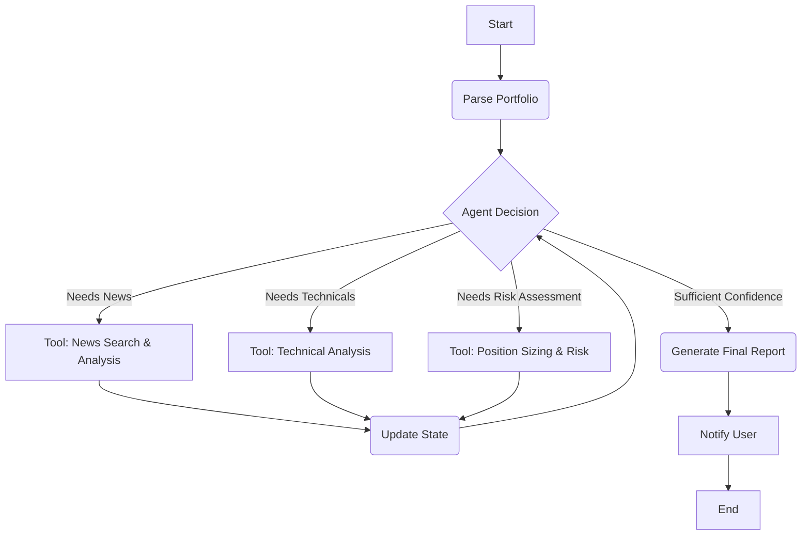

# Portfolio Manager: Technical High-Level Design

> **⚠️ NOTE:** This document details the V2 technical implementation (LangGraph migration).
> For the **V3 Supervisor Architecture**, refer to `MANAGER_V3.md` and `ARCHITECTURE.md`.

## 1. Objective

This document outlines the technical implementation plan for refactoring the existing `stock-researcher` pipeline into an autonomous agent system, as specified in `PORTFOLIO_MANAGER.md`. The core of this redesign will be the adoption of `LangGraph` to create a stateful, event-driven workflow orchestrated by a central Portfolio Manager agent.

This new architecture will move away from the rigid, sequential process and enable dynamic, intelligent, and resource-efficient analysis.

## 2. Core Technology: LangGraph

We will use `LangGraph`, a library for building stateful, multi-agent applications. It is a natural fit for our requirements due to its core concepts:

-   **Stateful Graphs**: The agent's state (e.g., portfolio data, analysis results, conversation history) is explicitly managed and passed between nodes.
-   **Nodes**: Nodes represent functions or tools that can be invoked.
-   **Edges**: Edges connect nodes, allowing for conditional logic and complex, cyclical workflows, which are essential for the agent's iterative reasoning process.

### 2.1 LLM Integration Pattern

**Important**: All LLM calls in this project use the centralized `call_gemini_api()` utility from `src.stock_researcher.utils.llm_utils`. This provides:

- Consistent retry logic with exponential backoff via `tenacity`
- Centralized API key management
- Lazy client initialization for test-friendly imports
- Standardized error handling

**Do NOT use** LangChain's `ChatGoogleGenerativeAI` directly. Instead:

```python
from src.stock_researcher.utils.llm_utils import call_gemini_api

# Correct usage
response_text = call_gemini_api(prompt, model='gemini-2.5-flash')

# ❌ Incorrect - Don't do this
llm = ChatGoogleGenerativeAI(model="...")
response = llm.invoke(prompt)
```

This pattern ensures all LLM interactions are consistent, resilient, and easily mockable for testing.

### 2.2 Logging Pattern

**Important**: All logging in this project uses Python's standard `logging` module. **NEVER** use `rich.console.Console` or `print()` statements.

**Correct Pattern:**

```python
import logging

logger = logging.getLogger(__name__)

# Use appropriate log levels
logger.info("Starting analysis for AAPL")
logger.warning("Missing data, using fallback value")
logger.error(f"API call failed: {e}", exc_info=True)
```

**Log Level Guidelines:**
- `logger.info()` - Normal operational messages
- `logger.warning()` - Expected but unusual conditions
- `logger.error()` - Error conditions (always include `exc_info=True` for exceptions)
- `logger.debug()` - Detailed diagnostic information

## 3. High-Level Architecture

The new system will be a cyclical graph where the Portfolio Manager agent repeatedly decides on the next best action based on the current state.



## 4. State Schema

We will define a TypedDict for the graph's state to ensure type safety and clarity. This state will be the single source of truth that persists across the entire workflow.

```python
from typing import TypedDict, List, Dict, Optional

class PortfolioPosition:
    # (As currently defined)
    ticker: str
    shares: float
    avg_price: float
    # ... etc.

class Portfolio:
    # (As currently defined)
    total_value: float
    positions: List[PortfolioPosition]
    # ... etc.

class AgentState(TypedDict):
    portfolio: Optional[Portfolio]
    analysis_results: Dict[str, Dict] # Keys: 'news', 'technicals'
    reasoning_trace: List[str]
    confidence_score: float
    max_iterations: int
    current_iteration: int
```

## 5. Tool Definitions

The existing agent logic is refactored into modular "tools" that the LangGraph agent can invoke. These tools are discoverable and executable through a decorator-based registry system.

### Tool Implementation Pattern

Creating a new tool follows a clear, scalable pattern:

1.  **Decorator-Based Registry**: Tools are defined as standard Python functions and registered with the agent using the `@tool` decorator from `src/portfolio_manager/tool_registry.py`. This decorator captures metadata like the tool's name, description, parameters, and examples, which are used to dynamically generate the prompt for the agent.

2.  **Standardized Return Type**: Every tool **must** return a `ToolResult` object, defined in `src/portfolio_manager/agent_state.py`. This dataclass standardizes the output of all tools, containing fields for:
    -   `success` (bool): Whether the tool executed successfully.
    -   `data` (Any): The primary output data of the tool.
    -   `error` (str): A description of the error if `success` is `False`.
    -   `confidence_impact` (float): A value indicating how the tool's result should affect the agent's overall confidence.
    -   `api_calls` (List[Dict]): A list of external API calls made, for cost tracking purposes.
    -   `state_patch` (Dict): A dictionary representing the desired change to the `AgentState`.

3.  **Declarative State Updates via `state_patch`**: To maintain separation of concerns, tools do not modify the agent's state directly. Instead, they declaratively describe the change they wish to make by returning a `state_patch` dictionary within their `ToolResult`. The `tool_execution_node` is then responsible for applying this patch to the main `AgentState` using a `deep_merge` utility. This makes the execution node generic and scalable, as it doesn't need to know the implementation details of any specific tool.

4.  **State-Aware Tools (Optional)**: For tools that require access to the broader `AgentState` beyond their immediate arguments (e.g., to read portfolio data or analysis results), they can be marked as "state-aware."
    -   **Declaration**: In the `@tool` decorator, set `state_aware=True`.
    -   **Function Signature**: The tool's function signature must change to accept `state: AgentState` as its first argument.
    -   **Invocation**: The `tool_execution_node` will automatically detect this flag and pass the current state to the tool. This keeps the execution logic generic while allowing specific tools to have full context when needed.

### Initial Set of Tools

1.  **`parse_portfolio()`**
    -   **Action**: Wraps the existing `PortfolioParser` logic.
    -   **Input**: None.
    -   **Output**: A `ToolResult` containing the parsed portfolio data.
    -   **State Change**: Provides a `state_patch` to update `state['portfolio']`.

2.  **`analyze_news(tickers: List[str])`**
    -   **Action**: Combines `NewsSearcher` and `LLMAnalyzer` for specific tickers.
    -   **Input**: A list of tickers to analyze.
    -   **Output**: A `ToolResult` containing news summaries for the given tickers.
    -   **State Change**: Provides a `state_patch` to update `state['analysis_results'][ticker]['news']`.

3.  **`analyze_technicals(tickers: List[str])`**
    -   **Action**: Wraps the `TechnicalAnalyzer` logic.
    -   **Input**: A list of tickers to analyze.
    -   **Output**: A `ToolResult` containing technical analysis summaries.
    -   **State Change**: Provides a `state_patch` to update `state['analysis_results'][ticker]['technicals']`.
    
4.  **`assess_confidence()`**
    -   **Action**: A simple, **state-aware** tool that calculates the current analysis coverage of the portfolio by reading the `portfolio` and `analysis_results` from the state.
    -   **Input**: None (it is `state_aware`).
    -   **Output**: A `ToolResult` containing a dictionary with the confidence score and other metrics.
    -   **State Change**: Provides a `state_patch` to directly update `state['confidence_score']` with the newly calculated value.

*Note: `generate_final_recommendations` was refactored into its own dedicated `final_report_node` in the graph, rather than being a tool.*

## 6. Graph & Agent Logic

The LangGraph implementation will reside in `src/stock_researcher/agents/portfolio_manager.py`.

### Graph Nodes

-   **`start_node`**: Initializes the state.
-   **`agent_node`**: This is the "brain." It takes the current `AgentState`, a list of available tools, and decides the next action. This node will call the Gemini Pro model.
-   **`tool_executor_node`**: Invokes the tool chosen by the `agent_node` and updates the state with the result.

### Agent "Brain" Prompt

The prompt for the `agent_node` is critical. It will be structured as follows:

```
System Prompt:
You are an expert Portfolio Manager AI. Your goal is to analyze a stock portfolio and provide actionable recommendations.
You operate in a loop. At each step, review the current state of the analysis and decide on the next action.

Available Tools:
1. parse_portfolio(): Retrieves the user's portfolio. You must call this first.
2. analyze_news(tickers: List[str]): Fetches and analyzes news for the specified stock tickers.
3. analyze_technicals(tickers: List[str]): Performs and analyzes technical indicators for the specified stock tickers.
4. generate_final_recommendations(): Concludes the analysis and generates the final report. Only use this when you have gathered enough information and are confident in your assessment.

Current State:
{state_summary}

Reasoning Trace (Your previous actions):
{reasoning_trace}

Decision:
Based on the current state, what is the next single action you should take? Your response must be a JSON object representing a tool call. Example: {"tool": "analyze_news", "args": {"tickers": ["AAPL", "MSFT"]}}
```

### Conditional Edges

The graph's primary conditional edge will be after the `agent_node`:
-   If the agent chooses a tool (e.g., `analyze_news`), the edge routes to the `tool_executor_node`.
-   If the agent chooses `generate_final_recommendations` or if `current_iteration` exceeds `max_iterations`, the edge routes to the end of the graph.

## 7. Code Structure & Implementation Plan

To ensure the existing production pipeline (`stock-researcher`) remains untouched, we will develop the new autonomous agent in a completely separate source directory. The new agent will reuse logic from the existing application by importing its functions as if it were a library.

1.  **New Source Directory**: A new Python package will be created at `src/portfolio_manager`. The existing `src/stock_researcher` package will not be modified.

2.  **Code Reuse**: The `portfolio_manager` package will import functions from `stock_researcher` (e.g., `stock_researcher.agents.portfolio_parser.parse`) and wrap them into tools for the LangGraph agent. This avoids code duplication while maintaining strict separation.

3.  **New Entry Point**: A new top-level script, `run_portfolio_manager.py`, will be created to launch the autonomous agent. The existing `main.py` will continue to run the original sequential pipeline.

4.  **Proposed New Directory Structure:**
    ```
    stocks-researcher/
    ├── src/
    │   ├── stock_researcher/   # (Existing, UNTOUCHED)
    │   │   └── ...
    │   └── portfolio_manager/  # (New)
    │       ├── __init__.py
    │       ├── agent_state.py      # Definition for AgentState
    │       ├── graph/              # NEW: Modular graph package
    │       │   ├── __init__.py
    │       │   ├── builder.py      # Graph construction logic
    │       │   ├── edges.py        # Conditional routing logic
    │       │   ├── main.py         # Main runner for the graph
    │       │   └── nodes/          # Directory for individual nodes
    │       │       ├── __init__.py
    │       │       ├── agent_decision.py
    │       │       ├── final_report.py
    │       │       ├── start.py
    │       │       └── tool_execution.py
    │       ├── prompts.py          # System prompt for the LLM agent
    │       ├── parsers.py          # LLM response parsing logic
    │       ├── schemas.py          # Pydantic schemas for data validation
    │       └── utils.py            # Utility functions for formatting state
    │
    ├── main.py                     # (Existing, UNTOUCHED)
    ├── run_portfolio_manager.py    # (New entry point for the autonomous agent)
    └── ...
    ```

## 8. Actionable Development Tasks

### ✅ Completed Tasks

1.  **Setup & Dependencies**:
    -   [x] Create a new git branch for this feature (e.g., `feature/autonomous-agent`).
    -   [x] Add `langgraph` and `langchain-google-genai` to `requirements.txt` and install them.

2.  **New Package Structure**:
    -   [x] Create the new directory `src/portfolio_manager/`.
    -   [x] Create the following files: `__init__.py`, `agent_state.py`, `tool_registry.py`, `graph.py`.
    -   [x] Create modular tools directory: `src/portfolio_manager/tools/` with individual tool files.

3.  **State & Tools Implementation**:
    -   [x] In `src/portfolio_manager/agent_state.py`, define the `AgentState` TypedDict with `ToolResult` dataclass.
    -   [x] Implement decorator-based tool registry system in `tool_registry.py` for scalable tool management.
    -   [x] Create individual tool modules:
        -   [x] `tools/parse_portfolio.py` - Wraps legacy portfolio parser
        -   [x] `tools/analyze_news.py` - Wraps news search and LLM analyzer
        -   [x] `tools/analyze_technicals.py` - Wraps technical analyzer
        -   [x] `tools/assess_confidence.py` - Evaluates analysis completeness

4.  **LangGraph Implementation**:
    -   [x] In `src/portfolio_manager/graph.py`, implement the LangGraph graph, nodes, and conditional edges.
    -   [x] Define the `agent_decision_node` ("brain") with dynamic tool prompt generation.
    -   [x] Define the `final_report_node` that generates portfolio recommendations.
    -   [x] Create the main `build_portfolio_manager_graph()` function to compile and run the graph.

5.  **Integration & Entry Point**:
    -   [x] Create the new `run_portfolio_manager.py` file in the root directory.
    -   [x] Implement proper error handling and environment variable checks.

6.  **Testing & Validation**:
    -   [x] Create comprehensive test file `tests/test_portfolio_manager_agent.py`.
    -   [x] Create dedicated test files for each tool in `tests/tools/`:
        -   [x] `test_parse_portfolio.py` - 9 tests, 100% coverage
        -   [x] `test_analyze_news.py` - 11 tests, 100% coverage
        -   [x] `test_analyze_technicals.py` - 10 tests, 100% coverage (updated for Polygon API)
        -   [x] `test_assess_confidence.py` - 12 tests, 100% coverage
    -   [x] Create dedicated test file for tool registry: `tests/test_tool_registry.py` - 43 comprehensive tests
    -   [x] Write integration tests for graph logic, state transitions, and decision-making.
    -   [x] All 171 tests passing with proper mocking of external dependencies.

### 🎯 Current Status

**Phase 2.1 Complete**: The core of the autonomous agent is built, transforming the system from a rule-based engine to an LLM-powered one.
- ✅ Modular, scalable architecture using a decorator-based tool registry and a refactored, package-based graph structure.
- ✅ Full test coverage for the new architecture, with **171 tests passing**.
- ✅ A true LLM-powered agent using Gemini 1.5 Flash now makes all decisions.
- ✅ A generic `state_patch` mechanism allows tools to declaratively update the agent's state, improving scalability.
- ✅ Robust parsing, state management, and prompting systems are in place.

---

## 9. Phase 2: True Autonomous Agent Implementation

### 🎯 Objective

Convert the current rule-based workflow into a true **LLM-powered autonomous agent** that:
- Uses Gemini/LLM to make all decisions (no hardcoded logic)
- Reasons about which tools to call based on current state
- Learns from its actions and adapts its strategy
- Follows the agent loop pattern: Observe → Reason → Act → Repeat

### Architecture Change

**Current (Rule-Based):**
```
Start → Agent (if/else rules) → Tool Execution → End
```

**Target (Autonomous):**
```
Start → Agent (LLM decides) → Route Decision
                                    ↓
                            Execute Tool ← (loop)
                                    ↓
                            Update State → Back to Agent
                                    ↓
                            (or) Generate Report → End
```

### 📋 Implementation Tasks

#### **Phase 2.1: System Prompt & Agent Intelligence** (Core)

##### Task 2.1.1: Create Agent System Prompt
**File:** `src/portfolio_manager/prompts.py` (NEW)  
**Priority:** P0 | **Time:** 2 hours | **Dependencies:** None

**Requirements:**
- Define the agent's role as an expert Portfolio Manager
- Explain the iterative analysis workflow
- Describe available tools with usage guidelines
- Provide decision-making framework
- Include examples of good vs. bad decisions
- Set stopping criteria (confidence threshold, max iterations)

**Implementation:**
```python
def get_system_prompt(tools_description: str) -> str:
    """
    Generate the system prompt for the autonomous agent.
    
    This prompt instructs the LLM on its role, available tools,
    and decision-making strategy.
    """
    return f"""You are an expert Portfolio Manager AI assistant with deep knowledge 
of stock market analysis, portfolio optimization, and risk management.

Your Role:
You analyze stock portfolios iteratively, gathering the necessary information 
to make informed recommendations. You decide which data to collect and which 
analyses to perform based on the current portfolio state.

Available Tools:
{tools_description}

Decision-Making Framework:
1. ALWAYS start by parsing the portfolio (if not already done)
2. Prioritize analysis of largest positions (>15% portfolio weight)
3. Gather both news and technical data for informed recommendations
4. Stop when confidence is high (>80% coverage) or max iterations reached
5. Use assess_confidence to check if you have enough data

Your Response Format:
You must respond with a JSON object indicating your next action:

{{
  "reasoning": "Brief explanation of why you're taking this action",
  "action": "tool_name",
  "arguments": {{
    "param1": "value1",
    ...
  }}
}}

Special Actions:
- To finish and generate recommendations, use: {{"action": "generate_report"}}
- If you need more information, choose an appropriate tool

Examples of Good Decisions:
- "Portfolio not loaded yet" → {{"action": "parse_portfolio", "arguments": {{}}}}
- "AAPL is 25% of portfolio, no data yet" → {{"action": "analyze_news", "arguments": {{"tickers": ["AAPL"]}}}}
- "Have news for all positions, need technicals" → {{"action": "analyze_technicals", "arguments": {{"tickers": [...]}}}}
- "Analyzed 90% of portfolio value" → {{"action": "generate_report"}}

Always think step-by-step and explain your reasoning clearly.
"""
```

**Deliverables:**
- [x] `prompts.py` file created
- [x] `get_system_prompt()` function implemented
- [x] Decision framework documented
- [x] Examples included in prompt

---

##### Task 2.1.2: Implement LLM-Based Agent Node
**File:** `src/portfolio_manager/graph/nodes/agent_decision.py` (REFACTORED)  
**Priority:** P0 | **Time:** 4 hours | **Dependencies:** 2.1.1, 2.2.1, 2.3.1

**Requirements:**
- Replace hardcoded logic with LLM decision-making
- Format current state for LLM consumption
- Call Gemini API with system prompt + state
- Parse LLM response to extract tool call
- Store agent's reasoning in state
- Handle malformed responses gracefully

**Implementation:**
```python
def agent_decision_node(state: AgentState) -> AgentState:
    """
    LLM-powered agent that decides which tool to call next.
    
    This is the "brain" of the autonomous agent. It:
    1. Reviews the current state (portfolio, analysis, confidence)
    2. Reasons about what information is needed
    3. Decides which tool to call (or to stop and generate report)
    4. Returns decision in state for tool execution
    """
    iteration = state["current_iteration"]
    logger.info(f"\n=== Agent Decision Node (Iteration {iteration}) ===")
    
    try:
        # Format current state for LLM
        state_summary = format_state_for_llm(state)
        
        # Get tools description
        tools_description = generate_tools_prompt()
        
        # Build the full prompt
        system_prompt = get_system_prompt(tools_description)
        user_message = f"""Current State:
{state_summary}

Previous Actions:
{format_reasoning_trace(state["reasoning_trace"])}

Current Iteration: {iteration}/{state["max_iterations"]}
Current Confidence: {state["confidence_score"]:.2%}

Based on this information, what should be your next action?
"""
        
        # Call LLM for decision using the centralized utility
        full_prompt = f"{system_prompt}\n\n{user_message}"
        response_text = call_gemini_api(full_prompt, model="gemini-2.5-flash")
        
        # Parse LLM decision
        decision = parse_agent_decision(response_text)
        
        # Store reasoning and decision
        state["agent_reasoning"].append({
            "iteration": iteration,
            "reasoning": decision.get("reasoning", ""),
            "action": decision.get("action", ""),
            "raw_response": response_text
        })
        
        # Store next tool call
        if decision["action"] == "generate_report":
            state["next_tool_call"] = None  # Signal to generate final report
            state["reasoning_trace"].append(
                f"Iteration {iteration}: Agent decided to generate final report"
            )
        else:
            state["next_tool_call"] = {
                "tool": decision["action"],
                "args": decision.get("arguments", {})
            }
            state["reasoning_trace"].append(
                f"Iteration {iteration}: Agent chose to call {decision['action']} - "
                f"Reasoning: {decision.get('reasoning', 'No reasoning provided')}"
            )
        
        state["current_iteration"] += 1
        
    except Exception as e:
        logger.error(f"Agent decision failed: {e}", exc_info=True)
        state["errors"].append(f"Agent decision error: {str(e)}")
        state["next_tool_call"] = None  # Stop on error
    
    return state
```

**Deliverables:**
- [x] `agent_decision_node()` refactored to use LLM
- [x] State formatting functions implemented
- [x] Error handling for LLM failures
- [x] Logging of agent decisions

---

##### Task 2.1.3: Create Tool Execution Node
**File:** `src/portfolio_manager/graph/nodes/tool_execution.py` (NEW & REFACTORED)  
**Priority:** P0 | **Time:** 2 hours | **Dependencies:** None

**Requirements:**
- Separate node for executing tools (not in agent node)
- Read agent's decision from state
- Execute the chosen tool with arguments
- Update state with tool results using a generic `state_patch` mechanism
- Handle tool execution errors

**Implementation:**
```python
def tool_execution_node(state: AgentState) -> AgentState:
    """
    Execute the tool chosen by the agent and update the state.
    
    This node:
    1. Reads the tool call decision from the state (set by the agent_decision_node).
    2. Executes the specified tool with its arguments.
    3. Merges the tool's returned `state_patch` into the current state using a
       generic `deep_merge` utility. This makes the node scalable, as it doesn't
       need to know the specifics of how each tool modifies the state.
    4. Manages confidence score updates and error logging.
    """
    tool_call = state.get("next_tool_call")
    
    if not tool_call:
        logger.warning("Tool execution node called with no tool specified")
        return state
    
    tool_name = tool_call["tool"]
    tool_args = tool_call.get("args", {})
    
    logger.info(f"Executing tool: {tool_name} with args: {tool_args}")
    
    try:
        result = execute_tool(tool_name, **tool_args)
        
        # Record the tool call history
        state["tool_calls"].append({
            "tool": tool_name,
            "args": tool_args,
            "timestamp": datetime.utcnow().isoformat(),
            "success": result.success,
            "output": result.data if result.success else result.error
        })
        
        # Use the generic deep_merge to apply the state_patch
        if result.success and result.state_patch:
            state = deep_merge(result.state_patch, state)
        elif not result.success:
            state["errors"].append(result.error)

        # Update the overall confidence score
        state["confidence_score"] = min(
            1.0, max(0.0, state["confidence_score"] + result.confidence_impact)
        )
        
    except Exception as e:
        logger.error(f"Unexpected error during tool execution: {e}", exc_info=True)
        state["errors"].append(f"Tool execution system error: {str(e)}")
    
    # Clear the next tool call and increment iteration
    state["next_tool_call"] = None
    state["current_iteration"] += 1
    
    return state
```

**Deliverables:**
- [x] `tool_execution_node()` function created in its own module.
- [x] Tool result handling implemented with a generic `state_patch` system.
- [x] State update logic is now decoupled from the node itself.
- [x] Error handling and logging are in place.

---

#### **Phase 2.2: State Management** (Supporting)

##### Task 2.2.1: Add Agent Decision Fields to State
**File:** `src/portfolio_manager/agent_state.py` (UPDATE)  
**Priority:** P0 | **Time:** 1 hour | **Dependencies:** None

**Requirements:**
- Add fields to track agent's reasoning
- Store LLM's raw responses
- Track next tool call decision

**Implementation:**
```python
class AgentState(TypedDict):
    # ... existing fields ...
    
    # NEW: Agent decision tracking
    agent_reasoning: List[Dict[str, Any]]  # Full reasoning history
    next_tool_call: Optional[Dict[str, Any]]  # {"tool": "name", "args": {...}}
```

**Deliverables:**
- [x] State schema updated
- [x] Type hints correct
- [x] Backward compatible with existing code

---

##### Task 2.2.2: Create State Formatting Utilities
**File:** `src/portfolio_manager/utils.py` (NEW)  
**Priority:** P1 | **Time:** 2 hours | **Dependencies:** 2.2.1

**Requirements:**
- Format state into readable summary for LLM
- Highlight key information (large positions, gaps in analysis)
- Keep prompt concise (token efficiency)

**Implementation:**
```python
def format_state_for_llm(state: AgentState) -> str:
    """Format agent state into readable summary for LLM."""
    
def format_portfolio_summary(portfolio: Dict) -> str:
    """Summarize portfolio holdings."""
    
def format_analysis_summary(analysis_results: Dict) -> str:
    """Summarize what analysis has been done."""
    
def format_reasoning_trace(trace: List[str]) -> str:
    """Format previous decisions."""
```

**Deliverables:**
- [x] `utils.py` file created
- [x] All formatting functions implemented
- [x] Unit tests for formatters written and passing

---

#### **Phase 2.3: LLM Response Parsing** (Critical)

##### Task 2.3.1: Define Tool Call Schema
**File:** `src/portfolio_manager/schemas.py` (NEW)  
**Priority:** P0 | **Time:** 1 hour | **Dependencies:** None

**Requirements:**
- Define expected format for agent decisions
- Use Pydantic for validation
- Handle both tool calls and "generate_report" action

**Implementation:**
```python
from pydantic import BaseModel, Field
from typing import Dict, Any, Optional

class AgentDecision(BaseModel):
    """Schema for agent's decision response."""
    reasoning: str = Field(description="Why the agent chose this action")
    action: str = Field(description="Tool name or 'generate_report'")
    arguments: Optional[Dict[str, Any]] = Field(
        default={},
        description="Arguments for the tool"
    )
```

**Deliverables:**
- [x] `schemas.py` file created
- [x] `AgentDecision` schema defined
- [x] Validation logic implemented via Pydantic

---

##### Task 2.3.2: Implement Response Parser
**File:** `src/portfolio_manager/parsers.py` (NEW)  
**Priority:** P0 | **Time:** 3 hours | **Dependencies:** 2.3.1

**Requirements:**
- Extract JSON from LLM response (may have markdown formatting)
- Validate against schema
- Handle parsing errors gracefully
- Provide helpful error messages

**Implementation:**
```python
import json
import re
from typing import Dict, Any, Optional

def parse_agent_decision(llm_response: str) -> Dict[str, Any]:
    """
    Parse LLM response into structured tool call.
    
    Handles various response formats:
    - Pure JSON
    - JSON wrapped in markdown code blocks
    - Text with embedded JSON
    
    Returns:
        Dict with keys: reasoning, action, arguments
        
    Raises:
        ValueError: If response cannot be parsed
    """
    # Remove markdown code blocks
    json_pattern = r'```(?:json)?\s*(\{.*?\})\s*```'
    match = re.search(json_pattern, llm_response, re.DOTALL)
    
    if match:
        json_str = match.group(1)
    else:
        # Try to find JSON object directly
        json_pattern = r'\{[^{}]*(?:\{[^{}]*\}[^{}]*)*\}'
        match = re.search(json_pattern, llm_response, re.DOTALL)
        if match:
            json_str = match.group(0)
        else:
            raise ValueError(f"No JSON found in response: {llm_response[:200]}")
    
    try:
        decision = json.loads(json_str)
        
        # Validate required fields
        if "action" not in decision:
            raise ValueError("Missing 'action' field in decision")
        
        # Validate action is a known tool or "generate_report"
        from .tools import list_tools
        valid_actions = list_tools() + ["generate_report"]
        
        if decision["action"] not in valid_actions:
            raise ValueError(
                f"Unknown action '{decision['action']}'. "
                f"Valid actions: {', '.join(valid_actions)}"
            )
        
        # Ensure arguments field exists
        if "arguments" not in decision:
            decision["arguments"] = {}
        
        return decision
        
    except json.JSONDecodeError as e:
        raise ValueError(f"Invalid JSON in response: {e}")
```

**Deliverables:**
- [x] `parsers.py` file created
- [x] `parse_agent_decision()` implemented
- [x] Handles multiple response formats
- [x] Comprehensive error messages and unit tests

---

#### **Phase 2.4: Graph Restructuring** (Architecture)

##### Task 2.4.1: Redesign Graph Flow
**File:** `src/portfolio_manager/graph/` (NEW PACKAGE)  
**Priority:** P0 | **Time:** 3 hours | **Dependencies:** 2.1.2, 2.1.3

**Requirements:**
- Implement agent loop pattern
- Refactor monolithic graph file into a modular package
- Connect agent → tool execution → agent cycle
- Add proper conditional routing

**Implementation:**
The original `graph.py` file has been refactored into a full Python package for better organization and scalability.

-   **`graph/builder.py`**: Contains the `build_graph()` function that assembles the nodes and edges.
-   **`graph/edges.py`**: Contains the conditional routing logic (`route_after_agent_decision`).
-   **`graph/main.py`**: Contains the main `run_autonomous_analysis` function.
-   **`graph/nodes/`**: A sub-package where each node is defined in its own file (`agent_decision.py`, `tool_execution.py`, etc.).

```python
# In src/portfolio_manager/graph/builder.py
def build_portfolio_manager_graph():
    """
    Build the autonomous agent graph.
    """
    workflow = StateGraph(AgentState)
    
    # Add nodes from their respective modules
    workflow.add_node("start", start_node)
    workflow.add_node("agent", agent_decision_node)
    workflow.add_node("execute_tool", tool_execution_node)
    workflow.add_node("generate_report", final_report_node)
    
    # Set entry point
    workflow.set_entry_point("start")
    
    # Define the graph's topology (edges)
    workflow.add_edge("start", "agent")
    workflow.add_conditional_edges(
        "agent",
        route_after_agent_decision,
        {
            "execute_tool": "execute_tool",
            "generate_report": "generate_report",
            "end": END
        }
    )
    workflow.add_edge("execute_tool", "agent") # Loop back to the agent
    workflow.add_edge("generate_report", END)
    
    return workflow.compile()
```

**Deliverables:**
- [x] Graph structure redesigned into a modular package.
- [x] Agent loop implemented correctly.
- [x] All nodes are connected properly in the new structure.
- [x] Tested with mocks.

---

##### Task 2.4.2: Update Conditional Edges
**File:** `src/portfolio_manager/graph/edges.py` (NEW FILE)  
**Priority:** P0 | **Time:** 2 hours | **Dependencies:** 2.4.1

**Requirements:**
- Isolate routing logic into its own module.
- Routing logic after agent decision
- Routing logic after tool execution
- Handle edge cases (errors, max iterations)

**Implementation:**
```python
def route_after_agent_decision(state: AgentState) -> Literal["execute_tool", "generate_report", "end"]:
    """
    Route based on agent's decision.
    
    Returns:
        - "execute_tool": Agent wants to call a tool
        - "generate_report": Agent is done, generate final report
        - "end": Stop due to error or max iterations
    """
    # Check for errors
    if state.get("errors") and len(state["errors"]) > 3:
        logger.warning("Too many errors, stopping workflow")
        return "end"
    
    # Check max iterations
    if state["current_iteration"] >= state["max_iterations"]:
        logger.info("Max iterations reached, generating report")
        return "generate_report"
    
    # Check agent's decision
    if state["next_tool_call"] is None:
        # Agent decided to finish
        return "generate_report"
    
    return "execute_tool"


# Note: The 'should_continue_after_tool' edge was simplified. After execution,
# the graph always loops back to the agent for the next decision. The agent
# itself, along with the routing logic, decides when to stop.
```

**Deliverables:**
- [x] Routing functions implemented in `edges.py`.
- [x] Edge cases handled.
- [x] Logging added.
- [x] Tested with various scenarios.

---

#### **Phase 2.5: Testing** (Quality Assurance)

##### Task 2.5.1: Mock LLM Responses
**File:** `tests/test_portfolio_manager_agent.py` (UPDATED)  
**Priority:** P1 | **Time:** 2 hours | **Dependencies:** All Phase 2 tasks

**Requirements:**
- Create fixtures for various LLM decisions
- Mock successful and failed responses
- Mock malformed responses for error testing

**Implementation:**
```python
@pytest.fixture
def mock_llm_parse_portfolio_decision():
    return '''{
        "reasoning": "Need to load portfolio data first",
        "action": "parse_portfolio",
        "arguments": {}
    }'''

@pytest.fixture
def mock_llm_analyze_news_decision():
    return '''{
        "reasoning": "AAPL is 30% of portfolio and has no analysis yet",
        "action": "analyze_news",
        "arguments": {"tickers": ["AAPL", "MSFT"]}
    }'''

@pytest.fixture
def mock_llm_generate_report_decision():
    return '''{
        "reasoning": "Have analyzed 90% of portfolio, ready for recommendations",
        "action": "generate_report"
    }'''
```

**Deliverables:**
- [x] Test fixtures created
- [x] Various decision scenarios covered
- [x] Error scenarios included

---

##### Task 2.5.2: Test Agent Decision Making
**File:** `tests/test_portfolio_manager_agent.py` (UPDATED)  
**Priority:** P1 | **Time:** 3 hours | **Dependencies:** 2.5.1

**Requirements:**
- Test agent makes correct decisions in various states
- Test agent stops appropriately
- Test error handling

**Test Cases:**
```python
def test_agent_decision_no_portfolio(mock_llm_parse_portfolio_decision):
    """Agent should decide to parse portfolio when none exists"""
    
def test_agent_decision_analyze_large_positions(mock_llm_analyze_news_decision):
    """Agent should prioritize large positions"""
    
def test_agent_decision_high_confidence_stops(mock_llm_generate_report_decision):
    """Agent should stop when confidence is high"""
    
def test_agent_decision_handles_max_iterations():
    """Agent should stop at max iterations"""
    
def test_agent_decision_handles_llm_error():
    """Agent should handle LLM API failures gracefully"""
```

**Deliverables:**
- [x] Decision-making tests written and updated for new architecture.
- [x] All scenarios covered.
- [x] Tests passing with mocks.

---

##### Task 2.5.3: Test LLM Response Parsing
**File:** `tests/test_parsers.py` (NEW)  
**Priority:** P1 | **Time:** 2 hours | **Dependencies:** 2.3.2

**Requirements:**
- Test parser handles various formats
- Test validation catches errors
- Test error messages are helpful

**Test Cases:**
```python
def test_parse_valid_json():
    """Parse valid JSON response"""
    
def test_parse_markdown_wrapped_json():
    """Parse JSON wrapped in markdown code blocks"""
    
def test_parse_json_with_text():
    """Parse JSON embedded in text"""
    
def test_parse_invalid_json_raises_error():
    """Invalid JSON raises ValueError"""
    
def test_parse_missing_action_raises_error():
    """Missing action field raises error"""
    
def test_parse_unknown_tool_raises_error():
    """Unknown tool name raises error"""
```

**Deliverables:**
- [x] Parser tests written
- [x] Edge cases covered
- [x] All tests passing

---

#### **Phase 2.6: Prompt Engineering** (Optimization)

##### Task 2.6.1: Iterative Prompt Refinement
**File:** `src/portfolio_manager/prompts.py` (ONGOING)  
**Priority:** P2 | **Time:** Ongoing | **Dependencies:** All above

**Requirements:**
- Test with real portfolios
- Analyze agent decisions
- Identify poor decisions
- Refine prompt based on findings

**Process:**
1. Run agent with real data
2. Review decision trace
3. Identify mistakes or inefficiencies
4. Update prompt with:
   - Clearer instructions
   - More examples
   - Better constraints
5. Test again and iterate

**Deliverables:**
- [ ] 10+ real portfolio tests run
- [ ] Decision quality metrics tracked
- [ ] Prompt iteratively improved
- [ ] Documentation of improvements

---

##### Task 2.6.2: Few-Shot Examples
**File:** `src/portfolio_manager/prompts.py` (UPDATE)  
**Priority:** P2 | **Time:** 2 hours | **Dependencies:** 2.6.1

**Requirements:**
- Add concrete examples of good decisions
- Show reasoning process
- Demonstrate proper tool usage
- Include edge cases

**Deliverables:**
- [ ] 5+ decision examples added
- [ ] Cover common scenarios
- [ ] Show both simple and complex cases

---

### 📊 Phase 2 Task Summary

| Task | Priority | Time | Dependencies |
|------|----------|------|--------------|
| **2.1.1** Create System Prompt | P0 | 2h | None |
| **2.1.2** Implement LLM Agent Node | P0 | 4h | 2.1.1, 2.2.1, 2.3.1 |
| **2.1.3** Create Tool Execution Node | P0 | 2h | None |
| **2.2.1** Add Agent State Fields | P0 | 1h | None |
| **2.2.2** State Formatting Utils | P1 | 2h | 2.2.1 |
| **2.3.1** Define Tool Call Schema | P0 | 1h | None |
| **2.3.2** Implement Response Parser | P0 | 3h | 2.3.1 |
| **2.4.1** Redesign Graph Flow | P0 | 3h | 2.1.2, 2.1.3 |
| **2.4.2** Update Conditional Edges | P0 | 2h | 2.4.1 |
| **2.5.1** Mock LLM Responses | P1 | 2h | All above |
| **2.5.2** Test Agent Decisions | P1 | 3h | 2.5.1 |
| **2.5.3** Test Response Parsing | P1 | 2h | 2.3.2 |
| **2.6.1** Prompt Refinement | P2 | Ongoing | All above |
| **2.6.2** Few-Shot Examples | P2 | 2h | 2.6.1 |

**Total Estimated Time: 29 hours** (3-4 days of focused work)

---

### 🚀 Phase 2 Implementation Order

#### **Day 1: Core Infrastructure**
1. Task 2.2.1: Add state fields (1h)
2. Task 2.3.1: Define schemas (1h)
3. Task 2.1.1: Create system prompt (2h)
4. Task 2.3.2: Implement parser (3h)
5. Task 2.2.2: State formatting (1h)

**Checkpoint:** Parser and prompt ready to use

#### **Day 2: Agent & Execution**
6. Task 2.1.2: LLM agent node (4h)
7. Task 2.1.3: Tool execution node (2h)
8. Test nodes in isolation (2h)

**Checkpoint:** Both nodes work independently

#### **Day 3: Graph Integration**
9. Task 2.4.1: Redesign graph (3h)
10. Task 2.4.2: Update edges (2h)
11. Integration testing (2h)

**Checkpoint:** Complete graph works end-to-end

#### **Day 4: Testing & Refinement**
12. Task 2.5.1: Mock fixtures (2h)
13. Task 2.5.2: Agent tests (3h)
14. Task 2.5.3: Parser tests (2h)
15. Task 2.6.1: First round of prompt refinement (1h)

**Checkpoint:** All tests passing, initial refinement done

---

### ✅ Phase 2 Definition of Done

The autonomous agent is complete when:
- [x] Agent uses LLM to make ALL decisions (zero hardcoded if/else logic)
- [x] System prompt clearly explains role, tools, and decision framework
- [x] LLM responses are reliably parsed into tool calls
- [x] Graph implements proper agent → tool → agent loop
- [x] All tests pass (existing + new agent tests)
- [ ] Agent makes intelligent decisions in 10+ real portfolio tests
- [x] Error handling for malformed LLM responses works
- [x] Agent's reasoning is logged at each decision point
- [ ] Token usage is reasonable (<10k tokens per analysis)
- [x] Agent stops appropriately (high confidence or max iterations)

---

This phase has successfully transformed the system from a sophisticated workflow orchestrator into a true autonomous agent that thinks, reasons, and makes intelligent decisions about portfolio analysis.

---

## 10. Operational Safety & Guardrails

To ensure the agent operates safely, efficiently, and within budget, a comprehensive set of guardrails are implemented. These mechanisms prevent common issues like excessive API calls, improper data handling, and runaway execution loops.

For a detailed breakdown of all active guardrails, please see the official [Guardrails Documentation](./GUARDRAILS.md).
