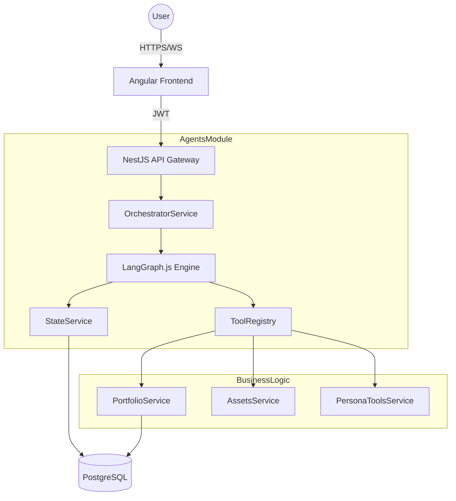
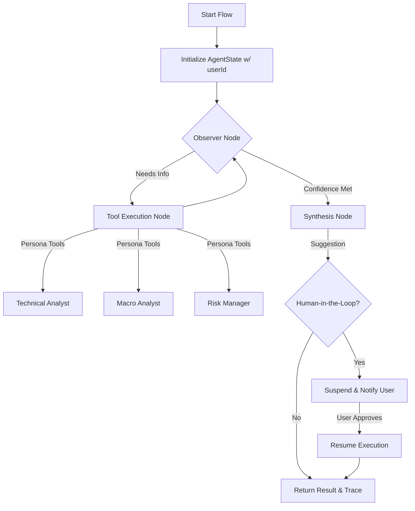

# Technical Design Document: Digital CIO Agent (Refactor)

## 1. Executive Technical Summary
This document outlines the architectural transition of the "Stocks Researcher" agent from a Python-based LangGraph implementation to a TypeScript-based NestJS integration using **LangGraph.js**. 

The "Digital CIO" will operate as a stateful, multi-agent system (MAS) embedded within the NestJS backend. By moving to TypeScript, we achieve:
- **Unified Tech Stack**: Seamless integration with existing `PortfolioModule` and `AssetsModule`.
- **First-Class Integration**: Agents directly invoke NestJS services as tools.
- **Enhanced Reliability**: Strict type safety via TypeScript and runtime validation via Zod.
- **User-Centric Execution**: All agent actions are scoped to the `userId` extracted from the execution context.

## 2. System Architecture & Diagrams

### 2.1 High-Level System Design


### 2.2 The Reasoning Loop (Stateful)


## 3. Technology Stack & Decision Logs

| Component | Technology | Justification |
| :--- | :--- | :--- |
| **Orchestration** | LangGraph.js | Provides stateful cycles and persistence parity with the Python version. |
| **Validation** | Zod | Ensures LLM outputs and tool inputs adhere to strict schemas. |
| **Technical Analysis** | `technicalindicators` | Widely adopted TS library for RSI, MACD, etc., ensuring mathematical consistency. |
| **State Persistence** | TypeORM + PostgreSQL | Leverages existing DB infra for `AgentState` and `ReasoningTrace`. |
| **Guardrails** | NestJS Middleware | Decouples financial/pricing responsibility (token limits) from business logic. |

## 4. Agentic Architecture (The Core)

### 4.1 Orchestrator Service
The `OrchestratorService` manages the lifecycle of graphs. It is responsible for:
- Initializing the `AgentState` with the `userId` from the JWT.
- Loading checkpoints from the `StateService`.
- Executing the graph and handling `Interrupts` for HITL.

### 4.2 Standalone Persona Tools
Instead of isolated agents, the "Personas" are exposed as **independent tools** that can be invoked across different flows:
- **Technical Analyst Tool**: Computes indicators using `technicalindicators`.
- **Macro Analyst Tool**: Fetches FRED/News data and provides economic context.
- **Risk Manager Tool**: Calculates VaR, Beta, and Portfolio Concentration.

### 4.3 User-Scoped Execution
Every graph execution is initialized with a `userId`. All tool calls (e.g., `fetch_portfolio`) MUST use this `userId` to ensure data isolation. The agent never operates with system-level permissions.

## 5. Data Model & Schema

### 5.1 `AgentState` (Entity)
Stores the serializable state of a LangGraph thread.
- `threadId`: UUID (Primary Key)
- `userId`: UUID (Index)
- `state`: JSONB (Current graph state)
- `status`: Enum (RUNNING, SUSPENDED, COMPLETED)

### 5.2 `ReasoningTrace` (Entity)
Stores the audit trail for every node execution.
- `id`: UUID
- `threadId`: UUID
- `nodeName`: String
- `toolCalled`: String (optional)
- `input`: JSONB
- `output`: JSONB
- `reasoning`: Text (The "thought process")

## 6. Implementation Guidelines & Coding Standards

### 6.1 Directory Structure
```text
backend/src/modules/agents/
├── controllers/          # Entry points (Trigger analysis)
├── dto/                 # Zod schemas for LLM communication
├── entities/            # AgentState, ReasoningTrace
├── graphs/              # LangGraph definitions (CIO, Auditor)
├── middleware/          # PricingMiddleware (Token tracking)
├── services/            # Orchestrator, State, ToolRegistry
└── tools/               # PersonaTools (Technical, Macro, Risk)
```

### 6.2 Error Handling: The "Missing Data" Policy
- **Missing Historical Prices**: If a tool cannot find price data required for cost-basis or analysis, it MUST throw a specialized `MissingDataException`. The graph will catch this and terminate the flow with a user-friendly error message.
- **Tool Failures**: Standardized `ToolResult` interface: `{ success: boolean, data?: any, error?: string }`.

## 7. Phased Roadmap

### Phase 1: Infrastructure & Core Wiring ✅ **COMPLETE**
**Status**: Production-Ready (January 3, 2026)

**Completed Deliverables**:
- ✅ **Dependencies Installed**: `@langchain/langgraph`, `@langchain/core`, `@langchain/google-genai`, `@langchain/langgraph-checkpoint-postgres`
- ✅ **State Management**: `StateService` wrapping PostgresSaver with thread scoping
- ✅ **TypeORM Entities**: `TokenUsage` and `ReasoningTrace` with full CRUD
- ✅ **Token Tracking**: `TokenUsageService` with cost calculation (ready for Phase 2 LLM calls)
- ✅ **Tool Registry**: `ToolRegistryService` with example tool (get_current_time)
- ✅ **CIO Graph**: Observer → End node flow with state persistence
- ✅ **API Layer**: JWT-protected `/agents/run` endpoint with Zod validation
- ✅ **Module Wiring**: `AgentsModule` integrated into `AppModule`
- ✅ **Gemini LLM**: `GeminiLlmService` with retry logic and token extraction

**Test Coverage**:
- ✅ 66 unit tests passing
- ✅ 7 E2E tests passing
- ✅ 0 lint errors in new code
- ✅ Build succeeds
- ✅ Live production test verified

**Documentation**:
- ✅ `backend/src/modules/agents/README.md` - Module documentation
- ✅ `backend/PHASE_1_TEST_RESULTS.md` - Live test results

See: [Phase_1_Infrastructure_Core_Wiring.md](Phase_1_Infrastructure_Core_Wiring.md) for detailed task breakdown.

### Phase 2: Persona Tool Porting
- **Technical Persona**: Build the `TechnicalAnalystTool` using `technicalindicators`.
- **Macro Persona**: Build the `MacroAnalystTool` (FRED/News wrappers).
- **Risk Persona**: Build the `RiskManagerTool` for portfolio metrics.
- **Validation**: Ensure all tools are "user-aware" (receiving `userId`).

### Phase 3: Advanced Flows & HITL
- **The Alpha Auditor Flow**: Implement transaction-ledger analysis logic.
- **Human-in-the-Loop**: Implement the `Interrupt` logic in LangGraph.js and persistence for suspended states.
- **Reasoning Traces**: Implement the persistence layer for capturing LLM "thoughts."

### Phase 4: Frontend & Streaming
- **API Expansion**: Create endpoints for the "Reasoning Console."
- **WebSocket Integration**: (Optional) Stream live updates from the graph to the UI.
- **End-to-End Testing**: Execute "The Sector Switcher" flow from the UI.

