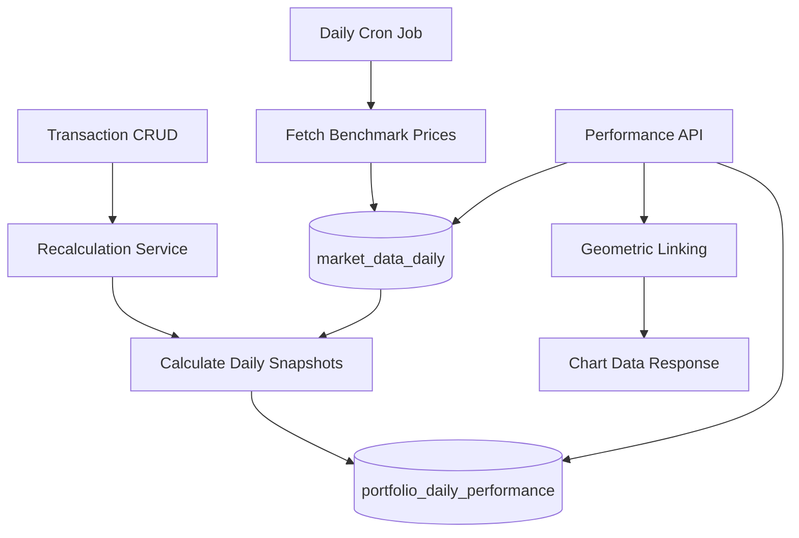

# Daily Performance Snapshots - Technical Documentation

## Overview

Portfolio performance in the Stocks Researcher application is calculated using a **Daily Snapshot** pattern. Instead of calculating performance on-the-fly from raw transactions on every request, the system pre-calculates and stores portfolio metrics daily using the **Time-Weighted Return (TWR)** methodology.

This approach ensures:
- **Fast API responses**: Performance data is read directly from snapshots (<20ms).
- **Consistency**: Deterministic results regardless of when the request is made.
- **Accuracy**: Proper handling of external cash flows (deposits/withdrawals) without distorting returns.

### Performance Comparison

| Metric | Old System (On-the-fly) | New System (Snapshots) |
|--------|-------------------------|------------------------|
| API Response Time | 2-5 seconds | <20ms |
| Historical Data Fetch | Every request | Once (pre-calculated) |
| Consistency | Variable | Deterministic |
| Scalability | Poor (O(n) per request) | Excellent (O(1) reads) |

## Architecture

## Database Schema

### Table 1: `market_data_daily`
Stores historical pricing for benchmarks (S&P 500, QQQ, etc.) from Polygon API.

- **Indices**: Composite unique index on `(ticker, date)`.
- **Close Price**: Adjusted close for total return calculation.

### Table 2: `portfolio_daily_performance`
Stores pre-calculated daily snapshots for each portfolio.

- **Indices**: Composite unique index on `(portfolioId, date)`.
- **Total Equity**: Sum of (Holdings * Price) + Cash at EOD.
- **Daily Return Pct**: The TWR component for that specific day.

## Core Algorithms

### 1. Daily Return Calculation (TWR)
The formula ensures that external cash flows (deposits and withdrawals) do not affect the performance percentage of the portfolio.

$$r_i = \frac{EndEquity - StartEquity - NetCashFlow}{StartEquity + NetCashFlow}$$

**Where:**
- $r_i$ = Daily return percentage for day $i$.
- $EndEquity$ = Total portfolio value at end of day (holdings × prices + cash).
- $StartEquity$ = Total portfolio value at end of previous day (from previous snapshot).
- $NetCashFlow$ = Deposits (+) minus Withdrawals (-) on day $i$.

### 2. Backfill & Replay Logic
When a historical transaction is created, edited, or deleted, the system must "replay" the portfolio history from that date forward to maintain accuracy.

1. **Delete** existing snapshots from the transaction date to today.
2. **Calculate** positions sequentially for each business day.
3. **Fetch** market prices for those positions.
4. **Save** new snapshots for each day.

### 3. Geometric Linking (Cumulative Returns)
To show performance over time (e.g., in a chart), daily returns are linked together:

$$Cumulative_t = (1 + Cumulative_{t-1}) \times (1 + r_t) - 1$$

## Example Calculation

**Scenario**: Portfolio with a deposit mid-period.

| Date | Action | Equity Start | Cash Flow | Equity End | Daily Return |
|------|--------|--------------|-----------|------------|--------------|
| Day 1 | Initial deposit | $0 | +$10,000 | $10,000 | 0% |
| Day 2 | Stock appreciates | $10,000 | $0 | $11,000 | 10% |
| Day 3 | User deposits | $11,000 | +$5,000 | $16,500 | 3.125% |

**Day 3 Calculation:**
$r_3 = \frac{16,500 - 11,000 - 5,000}{11,000 + 5,000} = \frac{500}{16,000} = 0.03125 = 3.125\%$

Without TWR, a simple return calculation would incorrectly show: $(16,500 - 11,000) / 11,000 = 50\%$.

## System Integration

### Event-Driven Backfill
The system uses `@nestjs/event-emitter` to decouple transaction management from performance calculations.
- `TransactionsService` emits a `transaction.historical` event on any change.
- `DailySnapshotCalculationService` listens and triggers a non-blocking backfill.

### Scheduled Jobs
A daily cron job (`ScheduledMarketDataJobService`) runs at 6 PM EST (Monday-Friday) to:
1. Fetch closing prices for all configured benchmarks (SPY, QQQ, etc.).
2. Store them in `market_data_daily`.
3. Ensure benchmark comparison data is always ready for the next day.

## API Reference

### Internal Admin
- `POST /api/performance/:portfolioId/admin/backfill`: Manually trigger a full recalculation.

### Client Performance
- `GET /api/performance/:portfolioId/benchmark-comparison`: Get TWR return vs benchmark.
- `GET /api/performance/:portfolioId/history`: Get time-series data for charting.
